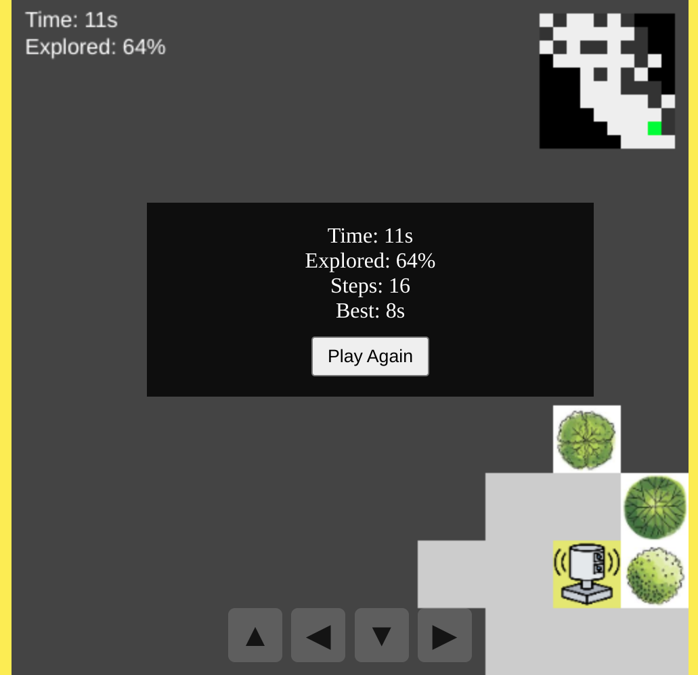

# 🌿 Mapping the Wild: 3D Forest Ecology with LiDAR ✨

Welcome to our project! This repository features research from Dr. Jan van Aardt’s lab at Rochester Institute of Technology, where we explore forest ecosystems in 3D using terrestrial LiDAR and machine learning.

From the temperate woodlands of Harvard Forest to the tropical mangroves of Palau, we study forest structure—canopy, stems, understory, ground, and more—to support ecological monitoring, modeling, and conservation.

Our goal: Make forests measurable, mappable, and meaningful using cutting-edge 3D technologies.

Feel free to explore and connect!

## Visuals
### Spherical Scan Pattern  
  
*Schematic spherical projection of the LiDAR scan pattern, showing the azimuth‑elevation grid used for unwrapping the 3D point cloud.*

---

### **Harvard Forest Virtual Sphere**  
  
*Virtual sphere reconstructed by back‑projecting 2D spherical feature maps (roughness = R, intensity = G, range = B) into 3D, showcasing fine structural details of the forest canopy and undergrowth.*

---

### **Palau Mangrove Virtual Sphere**  
  
*Virtual sphere reconstructed by back‑projecting PCA‑derived pseudo‑RGB spherical maps into 3D, enhancing structural contrasts in the mangrove root network.*

---

## 🎮 Have Fun with a LiDAR Game
click to play 👉 https://fz-rit.github.io/echoforest 👈  

## 🎶 A LiDAR-Themed Song
🎧 [**Click here to listen**](https://drive.google.com/file/d/1Zg-VZyGYSbMQ--5iUl5PbKFdScRg1-03/view?usp=sharing)

**Through the Laser’s Eye**

**[Verse 1]**  
Down a quiet trail, where the shadows lie,  
I see the woods through a laser’s eye.  
No rustlin’ leaves, no evening breeze,  
But every root and branch is freezin’ time with ease.  

**[Verse 2]**  
The trees stand tall in lines of light,  
No sun above, no day or night.  
Yet every limb and twist and bend  
Gets captured true like an old-time friend.  

**[Chorus]**  
Through the laser’s eye, I see the past,  
Every tree and trail built to last.  
It’s not just lines, it’s where life stood—  
A quiet map of the neighborhood.  
It holds the echoes, still and wide—  
Of stories the forest used to hide.

---

## Contact

- [Fei Zhang](https://www.linkedin.com/in/fei-zh/) – Postdoctoral Researcher, RIT  
- [Rob Chancia](https://www.rit.edu/directory/roccis-rob-chancia) – Research Scientist, RIT  
- [Josie Clapp](https://www.linkedin.com/in/josie-clapp/) – Undergraduate Student, RIT  
- Richard MacKenzie – Research Collaborator, U.S. Forest Service  
- [Jan van Aardt](https://www.rit.edu/directory/jvacis-jan-van-aardt) – Professor & Lab Director, RIT

## Send Us a Message
Have questions, feedback, or ideas? We’re always looking to connect with fellow researchers, students, and enthusiasts!  
📬 [Click here to send us a message](https://fz-rit.github.io/TLS-showcase/) 👈
